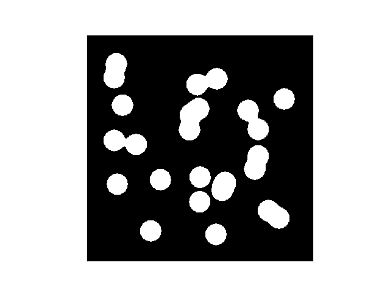

In this exercise, you will write tests for a function `count_specimens`.

`count_specimens` is used to count the number of specimens in
microscopic images. An example image is given below:



The images are assumed to be in **binary** format,
i.e., they can be represented by arrays of 0s (dark pixels)
and 1s (bright pixels). For example, the image above may be represented
by the following 32-by-32 array:

```
0,0,0,0,0,0,0,0,0,0,0,0,0,0,0,0,0,0,0,0,0,0,0,0,0,0,0,0,0,0,0,0
0,0,0,0,0,0,0,0,0,0,0,0,0,0,0,0,0,0,0,0,0,0,0,0,0,0,0,0,0,0,0,0
0,0,1,1,1,1,0,0,0,0,0,0,0,0,0,0,0,0,0,0,0,0,0,0,0,0,0,0,0,0,0,0
0,0,1,1,1,1,0,0,0,0,0,0,0,0,0,0,0,0,0,0,0,0,0,0,0,0,0,0,0,0,0,0
0,0,1,1,1,1,0,0,0,0,0,0,0,0,0,0,0,1,1,1,0,0,0,0,0,0,0,0,0,0,0,0
0,0,1,1,1,1,0,0,0,0,0,0,0,0,1,1,1,1,1,1,1,0,0,0,0,0,0,0,0,0,0,0
0,0,1,1,1,1,0,0,0,0,0,0,0,1,1,1,1,1,1,1,1,0,0,0,0,0,0,0,0,0,0,0
0,0,1,1,1,1,0,0,0,0,0,0,0,1,1,1,1,1,1,1,0,0,0,0,0,0,1,1,1,1,0,0
0,0,0,1,1,1,1,0,0,0,0,0,0,0,1,1,1,1,1,0,0,0,1,1,0,0,1,1,1,1,0,0
0,0,0,1,1,1,1,0,0,0,0,0,0,1,1,1,1,1,0,0,0,1,1,1,1,0,1,1,1,1,0,0
0,0,0,1,1,1,1,0,0,0,0,0,1,1,1,1,1,1,0,0,1,1,1,1,1,0,1,1,1,1,0,0
0,0,0,1,1,1,1,0,0,0,0,0,1,1,1,1,1,1,0,0,0,1,1,1,1,1,0,0,0,0,0,0
0,0,0,0,0,0,0,0,0,0,0,0,1,1,1,1,1,0,0,0,0,1,1,1,1,1,1,0,0,0,0,0
0,0,1,1,1,1,1,1,0,0,0,0,1,1,1,1,1,0,0,0,0,0,1,1,1,1,1,0,0,0,0,0
0,0,1,1,1,1,1,1,1,0,0,0,1,1,1,1,1,0,0,0,0,0,1,1,1,1,0,0,0,0,0,0
0,0,1,1,1,1,1,1,1,0,0,0,0,1,1,1,0,0,0,0,0,0,1,1,1,1,0,0,0,0,0,0
0,0,1,1,1,1,1,1,1,0,0,0,0,0,0,0,0,0,0,0,0,0,1,1,1,1,1,0,0,0,0,0
0,0,0,0,0,1,1,1,0,0,0,0,0,0,0,0,0,0,0,0,0,0,1,1,1,1,1,0,0,0,0,0
0,0,0,0,0,0,0,0,0,1,1,1,0,0,1,1,1,1,0,0,0,1,1,1,1,1,0,0,0,0,0,0
0,0,1,1,1,1,0,0,1,1,1,1,1,0,1,1,1,1,1,1,1,1,1,1,1,1,0,0,0,0,0,0
0,0,1,1,1,1,1,0,1,1,1,1,1,0,1,1,1,1,1,1,1,1,1,1,1,1,0,0,0,0,0,0
0,0,1,1,1,1,1,0,1,1,1,1,1,0,1,1,1,1,1,1,1,1,0,0,0,0,0,0,0,0,0,0
0,0,1,1,1,1,0,0,0,1,1,1,0,0,1,1,1,1,1,1,1,1,0,0,0,0,0,0,0,0,0,0
0,0,0,0,1,0,0,0,0,0,0,0,0,0,1,1,1,1,1,1,1,0,0,0,1,1,1,1,0,0,0,0
0,0,0,0,0,0,0,0,0,0,0,0,0,0,1,1,1,1,0,0,0,0,0,1,1,1,1,1,1,0,0,0
0,0,0,0,0,0,0,0,1,1,0,0,0,0,1,1,1,1,0,0,0,0,0,1,1,1,1,1,1,1,0,0
0,0,0,0,0,0,0,1,1,1,1,0,0,0,0,0,0,1,1,1,0,0,0,0,1,1,1,1,1,1,0,0
0,0,0,0,0,0,0,1,1,1,1,0,0,0,0,0,1,1,1,1,1,0,0,0,0,1,1,1,1,0,0,0
0,0,0,0,0,0,0,1,1,1,1,0,0,0,0,0,1,1,1,1,1,0,0,0,0,0,0,0,0,0,0,0
0,0,0,0,0,0,0,1,1,1,1,0,0,0,0,0,1,1,1,1,0,0,0,0,0,0,0,0,0,0,0,0
0,0,0,0,0,0,0,0,0,0,0,0,0,0,0,0,0,1,1,0,0,0,0,0,0,0,0,0,0,0,0,0
0,0,0,0,0,0,0,0,0,0,0,0,0,0,0,0,0,0,0,0,0,0,0,0,0,0,0,0,0,0,0,0
```

The function `count_specimens` accepts a (binary) NumPy array
as input and returns the number of "specimens" found in this "image".
For example, if `img` is an array representing the above image,
`count_specimens` can be used as follows:

```
In  [1]: count_specimens(img)
Out [1]: 16
```

**Assumptions**:

1. The bright pixels (1) representing each object are completely surrounded by dark pixels (0).
2. There are no "holes" in each object, i.e., each object is a continuous blob of bright pixels (1),
with no dark pixels (0) inside this blob.

Each test should be wrapped in a function, whose name starts with `test_`.
For example, here is a test which checks that for an array of all 0s,
`count_specimens` returns 0:

```
def test_count_zero_specimens()
    img = np.array(
      [[ 0.,  0.,  0.,  0.,  0.],
       [ 0.,  0.,  0.,  0.,  0.],
       [ 0.,  0.,  0.,  0.,  0.],
       [ 0.,  0.,  0.,  0.,  0.],
       [ 0.,  0.,  0.,  0.,  0.]])
    assert(count_specimens(img) == 0)
```

All tests shuold be placed in a file `test_counting.py`:

```
micro/
├── micro/
│   ├── __init__.py
├── README.md
├── LICENSE.md
├── setup.py
└── tests
    └── test_counting.py
```
